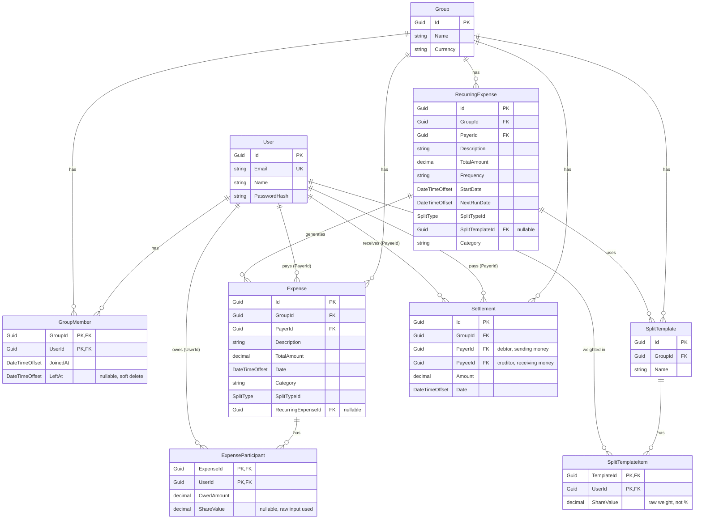

# ExpenseSplitter


A full-stack expense-splitting application (Splitwise-style) built with **ASP.NET Core 8 + EF Core** on the backend and **Angular** on the frontend. Built as a capstone/portfolio project for a .NET Full Stack trainee program.

Unlike a basic Splitwise clone, this app supports **per-expense participant selection** (not everyone in a group has to be part of every expense), **prorated recurring bills** that handle mid-cycle membership changes, and **debt simplification** to minimize the number of settlement transactions needed to clear a group's balances.

---

## Tech Stack

**Backend:** ASP.NET Core 8 Web API, Entity Framework Core, SQLite (dev), JWT Authentication, xUnit + Moq + WebApplicationFactory for testing
**Frontend:** Angular (standalone components), TypeScript, RxJS, HttpClient with a JWT interceptor

---

## Features

### 1. Per-Expense Participant Selection
Group membership and expense participation are modeled as two separate concepts. A group of 5 people can have an expense involving only 4 of them — the 5th person simply isn't part of that `Expense`'s participant list and owes nothing for it. The UI defaults to pre-checking every group member for a new expense and lets the user uncheck whoever wasn't involved.

### 2. Flexible Split Engine
Every expense can be split:
- **Equal** — divided evenly, with leftover cents distributed deterministically (see below)
- **Percentage** — must sum to 100% across all participants (including the payer's own share, if any)
- **Exact Amount** — must sum to the total expense amount
- **Template** — a reusable, group-level split rule (e.g. "rent by room size") using arbitrary weights, not required to sum to 100

### 3. Recurring Expenses with Day-by-Day Proration
Recurring bills (like monthly rent) don't just divide the total evenly across whoever happens to be in the group when the bill generates. Instead, the app:
- Walks the billing cycle **day by day**
- Determines who was an active group member on each specific day (based on `JoinedAt`/`LeftAt`)
- Computes a daily cost (`TotalAmount / DaysInCycle`) and distributes it among that day's active members, weighted by their split weight
- Sums each member's daily shares across the cycle into their final amount

This means if someone moves out mid-month, the remaining members automatically absorb their share for the remaining days — without any special-cased "redistribution" logic. It falls out naturally from computing the split independently for every day.

### 4. Debt Simplification
Rather than requiring every debtor to pay every creditor individually, the app computes net balances per person and runs a **greedy two-pointer settlement algorithm**: it sorts creditors and debtors by amount, then repeatedly matches the largest creditor with the largest debtor, settling the smaller of the two amounts and advancing whichever side reaches zero. This minimizes the number of transactions needed to clear all debts in a group.

---

## Key Design Decisions

These were deliberate choices made during development, worth understanding for anyone extending the project:

| Decision | Choice | Why |
|---|---|---|
| Payer representation | `Expense.PayerId` is explicit; `ExpenseParticipant` rows only exist for debtors | Simpler queries ("who owes on this expense" is just the participant list) and avoids a self-referential debt row for the payer |
| Remainder cents | Sorted deterministically by `UserId`, extra cents given to the first N participants in that order | Splitting $100 three ways gives 33.33/33.33/33.33 (sums to 99.99) — the remainder must go *somewhere*, and a deterministic rule keeps this testable and explainable, rather than an arbitrary "give it to whoever" |
| Group membership | Soft delete via `LeftAt` (not hard delete) | Preserves historical accuracy for past expenses/proration and allows a user to rejoin a group cleanly |
| User deletion in financial tables | `DeleteBehavior.Restrict` on every FK from `Expense`, `ExpenseParticipant`, `Settlement`, and `SplitTemplateItem` to `User` | A user with financial history should never be hard-deleted — doing so would silently corrupt the ledger for everyone else in the group. (Known limitation: there is currently no path to fully delete a user account that has financial history — this would need a dedicated anonymization flow.) |
| Recurring expense snapshotting | Each generated cycle's `Expense` gets its own hard-copied participant list and calculated amounts | Prevents later changes to group membership or split templates from retroactively altering historical months |
| Debt simplification algorithm | Greedy two-pointer sweep over pre-sorted creditor/debtor lists — O(N log N) | Simple to reason about, easy to unit test, and sufficient for typical group sizes; a max-flow or ILP approach would be solving a problem this app doesn't have |
| Template split weights | Arbitrary positive weights (e.g. room sizes 12/15/18), not normalized to 100 | Forcing users to manually convert real-world ratios into percentages summing to 100 is bad UX; `CalculateWeighted` divides by the sum of weights instead |
| JWT secret | Stored via `dotnet user-secrets` in development, never committed to `appsettings.json` | Basic secret hygiene, avoids leaking a signing key into source control |
| Group-scoped authorization | A reusable `[RequireGroupMember]` action filter, applied per-controller, checks membership from the route's `groupId` | Avoids repeating the same DB check in every controller method; keeps the authorization concern centralized |

---

## Data Model

- **User** — account, email, password hash
- **Group** — a shared expense group with a currency
- **GroupMember** — join table between `Group` and `User`, with `JoinedAt`/`LeftAt` for soft-delete and historical proration
- **Expense** — a single cost: payer, total amount, split type, description, category, date; optionally linked back to a `RecurringExpense` if auto-generated
- **ExpenseParticipant** — join table between `Expense` and `User` for **debtors only**; stores the calculated `OwedAmount` and the raw `ShareValue` used to compute it
- **SplitTemplate** / **SplitTemplateItem** — a reusable, named split rule per group (e.g. "Rent by Room Size") with arbitrary per-user weights
- **RecurringExpense** — a scheduled bill (frequency, next run date, default split rule) that a background service turns into concrete `Expense` records
- **Settlement** — a recorded cash payment between two users, which offsets future balance calculations

---

## Database Schema

### Entity-Relationship Diagram



### Notable Constraints

- **Composite primary keys** on all join tables (`GroupMember`, `ExpenseParticipant`, `SplitTemplateItem`) — e.g. `(GroupId, UserId)` — since a user can only have one active row per group/expense/template.
- **`DeleteBehavior.Restrict`** is explicitly configured (via Fluent API in `OnModelCreating`, overriding EF Core's default cascade) on every foreign key from a financial table (`Expense.PayerId`, `ExpenseParticipant.UserId`, `Settlement.PayerId`/`PayeeId`, `SplitTemplateItem.UserId`) back to `User`. This guarantees a user can never be deleted while they have financial history attached — see the design decisions table above for why.
- **`GroupMember.LeftAt`** is nullable and defaults to `null` (active). Membership is never hard-deleted, which is what makes historical proration on past recurring expenses possible even after someone leaves a group.
- **`ExpenseParticipant` only contains debtor rows** — the payer never has a row here. Their share, if any, is computed but never persisted (see design decisions).

---

## API Overview

```
POST   /api/auth/register
POST   /api/auth/login

POST   /api/groups
GET    /api/groups/{groupId}/members
POST   /api/groups/{groupId}/members
DELETE /api/groups/{groupId}/members/{userId}

POST   /api/groups/{groupId}/expenses
GET    /api/groups/{groupId}/expenses
GET    /api/groups/{groupId}/balances

POST   /api/groups/{groupId}/splittemplates
GET    /api/groups/{groupId}/splittemplates

POST   /api/groups/{groupId}/recurring-expenses
GET    /api/groups/{groupId}/recurring-expenses/{id}/preview

GET    /api/groups/{groupId}/settlements/suggested
POST   /api/groups/{groupId}/settlements
```

All group-scoped endpoints require a valid JWT (`Authorization: Bearer <token>`) and active membership in the group.

---

## Running Locally

### Backend
```bash
cd ExpenseSplitter.Api
dotnet user-secrets set "JwtSettings:Secret" "<your-dev-secret>"
dotnet ef database update
dotnet run
```
API will be available at `https://localhost:7119` (Swagger UI at `/swagger`).

### Frontend
```bash
cd ExpenseSplitter.Ui
npm install
npm start
```
App will be available at `http://localhost:4200`.

### Tests
```bash
cd ExpenseSplitter.Api.Tests
dotnet test
```

---

## Testing Approach

The backend is covered by a mix of:
- **Pure unit tests** for isolated logic with no DB dependency — `SplitCalculator`, `ProrationCalculator`, `SettlementCalculator`
- **Controller-level tests** using an EF Core in-memory database, verifying end-to-end request handling within a single controller
- **Full HTTP integration tests** using `WebApplicationFactory`, which exercise the real middleware pipeline — used specifically for anything that depends on `[Authorize]`, `[RequireGroupMember]`, or multi-step flows (e.g. create an expense → record a partial settlement → verify the suggested settlement list updates correctly)

A recurring theme in development was **not trusting a description of behavior without seeing the actual code or test output** — several real bugs (an incorrect field-name mapping on the frontend, a template split incorrectly validated as a percentage split, a proration edge case around zero-active-member days) were caught this way before they reached the running app.

---

## Known Limitations / Future Work

- No path to fully delete a user account with financial history (by design — see the `Restrict` delete decision above); would need a dedicated anonymization flow
- Adding a group member currently requires their raw user ID rather than looking them up by email
- Recurring expense frequency currently supports monthly cycles; weekly/custom cycles would need the `Frequency` field's parsing logic extended
- No email notifications for new expenses, settlements, or upcoming recurring bills
